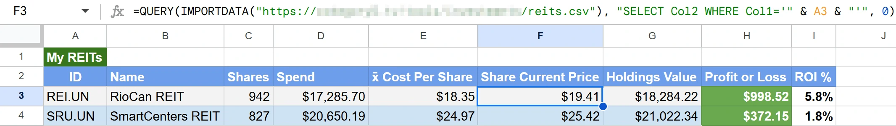

# reit2csv - Canadian REIT Price Scrape + Cache

## Overview

reit2csv is a Python script that fetches real-time stock prices for Canadian REITs using Yahoo Finance. It ensures data integrity by maintaining timestamps for unchanged values and only queries Yahoo Finance during market hours (9:30 AM - 4:00 PM EST). The collected data is stored in a CSV file, which can be used as a data source for spreadsheets or applications.

## Copyright & Author

- **Copyright (c) 2025 Robbie Ferguson, Category5 Technology TV**
- **Website:** [Category5.TV](https://Category5.TV)
- **Blog:** [Bald Nerd](https://baldnerd.com/)
- **Author:** Robbie Ferguson // Bald Nerd

## License

This project is licensed under the MIT License. See the LICENSE file for details.

## Important Disclaimer

This script utilizes Yahoo Finance data via the [yfinance library](https://github.com/ranaroussi/yfinance). Yahoo Finance does not provide official API access, and its data may be subject to rate limiting or service changes at any time.

The data retrieved is for informational purposes only and should not be used for financial trading without verification from official sources.

This project (reit2csv) is distributed for personal use only.

## Dependencies

reit2csv requires the following dependencies:

- **Python 3.x**
- **yfinance** (Yahoo Finance API) - Install via `pip install yfinance`
- **pyyaml** (YAML parser) - Install via `pip install pyyaml` or `apt install python3-yaml`
- **pytz** (Timezone handling) - Install via `pip install pytz`

## Usage

If you prefer not to run the application yourself, you can use our hosted version, provided by [Category5 TV](https://category5.tv/):

**[https://category5.tv/tools/investments/reits.csv](https://category5.tv/tools/investments/reits.csv)**

This file is automatically updated and can be used directly in your spreadsheets or applications. Please consider [supporting us](https://patreon.com/Category5).

reit2csv is designed to be run as a cron job to continuously update stock data while respecting market hours. The script will automatically handle whether the market is open or closed, so no additional logic is needed in your scheduling setup.

### Example Crontab Entry

To run the script every 15 minutes during weekdays:

```sh
*/15 * * * 1-5 /home/username/scripts/reit2csv/reit2csv > /dev/null 2>&1
```

Change `/home/username/scripts/reit2csv/reit2csv` to the actual path to `reit2csv` on your system.

## Output

The script generates a `reits.csv` file with the following columns:

- `Ticker`: The REIT's ticker symbol
- `Price`: The latest fetched price
- `Timestamp`: The date and time when the price was fetched

Example:

```csv
Ticker,Price,Timestamp
CAR.UN,55.23,2025-02-22 13:47:36
REI.UN,17.89,2025-02-22 13:47:36
```

### Loading Data into Google Sheets

To use the collected stock prices in Google Sheets, use the following formula:

```excel
=QUERY(IMPORTDATA("https://example.com/example_path/reits.csv"), "SELECT Col2 WHERE Col1='REI.UN'", 0)
```

Replace `https://example.com/example_path/reits.csv` with the actual URL where your CSV file is hosted. Replace `REI.UN` with the REIT you wish to lookup.



### Using Data in Excel

Excel does not have a built-in function like Google Sheets' `IMPORTDATA` function. Instead, users can use **Power Query** to import data from a URL or manually download and load the CSV. To extract the price of a specific REIT, functions like `FILTER` (Excel 365) or `INDEX` & `MATCH` can be used. Perhaps try searching for "Power Query import CSV from URL" or "Excel FILTER function" to find guides on setting it up. I do not use or provide any support for Excel.

## Configuration

Modify the following configuration options to match your setup:

```python
CONFIG_FILE = '/home/username/scripts/reit2csv/reits_config.yaml'
CSV_FILE = '/var/www/html/example_path/reits.csv'
```

These paths should point to your YAML configuration file and the CSV output location, respectively.

### YAML File Structure

The `reits_config.yaml` file is used to define the list of REITs that will be tracked. It follows this structure:

```yaml
stocks:
  SRU.UN:
    name: "SmartCentres REIT"
    url: "https://finance.yahoo.com/quote/SRU-UN.TO"
  REI.UN:
    name: "RioCan REIT"
    url: "https://finance.yahoo.com/quote/REI-UN.TO"
  CAR.UN:
    name: "Canadian Apartment Properties REIT"
    url: "https://finance.yahoo.com/quote/CAR-UN.TO"
```

- **Ticker Symbol:** The REIT's standard ticker symbol (e.g., SRU.UN). The script automatically converts this to Yahoo Finance's format (e.g., SRU-UN.TO) when fetching data.
- **Name:** A human-readable name for reference.
- **URL:** A direct link to Yahoo Finance for easy manual lookup (this is **not used** by the script but is included for reference).

A sample `reits_config.yaml` is included in the repository for easy setup. Be sure to point to it using the `CSV_FILE` string (see `Configuration` above).

## Error Handling

If the script encounters an error while fetching data for a ticker, it will first attempt to obtain retroactive data for both 1 day and 5 day values. If it continues to fail, reit2csv will check if it is already in your reits.csv output file. If so, the existing data will remain (rather than being replaced with N/A, for example). If a ticker is generating an error and does not yet exist in the reits.csv file, it will be assumed to be erroneous and not be added to the resulting CSV file. reit2csv will skip the failing ticker and continue processing the remaining tickers.

If running reit2csv from the console, you will see the error output. So if a particular ticker seems to be out of date (I.e., the Timestamp is in the past), or if a ticker in your YAML file is not being saved to the CSV file, you may run the script directly to see what yfinance is saying.

## Enjoy!

If you find this script useful, please consider [supporting us](https://patreon.com/Category5).
